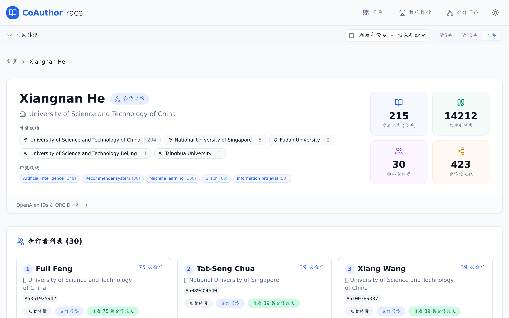

# CoAuthorTrace

基于 [OpenAlex](https://openalex.org/) 的学术合作关系追踪与分析系统 —— 爬取论文数据，计算作者关系强度，可视化合作网络。

An academic co-authorship tracking & analysis system powered by OpenAlex — crawl papers, compute relationship scores, and visualize collaboration networks.

## 页面预览 / Screenshots

<table>
  <tr>
    <td align="center"><b>机构学者排行 / Institution Ranking</b></td>
    <td align="center"><b>作者搜索 / Author Search</b></td>
    <td align="center"><b>作者主页 / Author Profile</b></td>
  </tr>
  <tr>
    <td></td>
    <td></td>
    <td></td>
  </tr>
</table>

## 功能特性 / Features

- **数据爬取** — 从 OpenAlex API 增量爬取论文与作者数据，支持多机构并行
- **作者去重** — 自动合并同名同机构作者，保留别名映射
- **研究领域** — 基于论文 concepts 自动计算作者研究方向
- **合作分析** — GraphSAGE GNN + 加权算法，量化作者关系强度
- **网络指标** — 度中心性、PageRank、中介中心性、聚类系数等
- **机构排名** — 按论文数 & 引用数展示机构内学者排行
- **合作网络** — vis-network 交互式合作图谱可视化
- **模糊搜索** — 支持 typeahead 补全的作者搜索

## 快速开始 / Quick Start

### 1. 安装依赖

```bash
# 后端 Backend
python -m venv venv && source venv/bin/activate
pip install -r requirements.txt

# 前端 Frontend
cd frontend && npm install
```

### 2. 配置

```bash
cp .env.example .env
```

按需修改 `.env`：

| 配置项 | 说明 |
|--------|------|
| `COAUTHOR_SCOPE__INSTITUTION_IDS` | 目标机构 OpenAlex ID 列表 |
| `COAUTHOR_SCOPE__CONCEPT_IDS` | 学科领域 ID 列表 |
| `COAUTHOR_SCOPE__FROM_DATE` | 数据起始日期 |

### 3. 初始化与数据采集

```bash
# 初始化数据库
python scripts/init_db.py

# 爬取数据（按优先级 / 全部 / 指定机构）
python scripts/crawl_manager.py --priority 0
python scripts/crawl_manager.py --all
python scripts/crawl_manager.py --institutions I99065089 I20231570

# 回填论文 concepts
python scripts/backfill_concepts.py --batch-size 200 --concurrent 20

# 计算作者研究领域
python scripts/compute_research_fields.py
```

### 4. 启动服务

```bash
# 后端 API (http://localhost:8000)
uvicorn src.api.main:app --host 0.0.0.0 --port 8000

# 前端 (http://localhost:3000)
cd frontend && npm run dev
```

API 文档：http://localhost:8000/api/docs

## 技术栈 / Tech Stack

| 层 | 技术 |
|----|------|
| **数据源** | OpenAlex API |
| **后端框架** | FastAPI · Uvicorn |
| **数据库** | SQLite + Redis |
| **GNN 分析** | PyTorch Geometric (GraphSAGE) |
| **调度** | APScheduler |
| **前端框架** | React 18 · Vite |
| **样式** | Tailwind CSS |
| **可视化** | vis-network · Framer Motion |
| **路由** | React Router v6 |

## API 端点 / API Endpoints

### Authors

| Method | Path | Description |
|--------|------|-------------|
| GET | `/api/v1/authors/search` | 作者搜索（支持模糊匹配） Author search |
| GET | `/api/v1/authors/institutions` | 机构列表 Institution list |
| GET | `/api/v1/authors/ranking/by-institution` | 机构内学者排名 Institution ranking |
| GET | `/api/v1/authors/{id}` | 作者详情 Author details |
| GET | `/api/v1/authors/{id}/top-relations` | Top-K 关系 Top relations |
| GET | `/api/v1/authors/{id}/network-metrics` | 网络中心性指标 Network metrics |
| GET | `/api/v1/authors/{id}/collaborators` | 合作者列表 Collaborators |
| GET | `/api/v1/authors/{id}/co-authored-papers/{cid}` | 合著论文 Co-authored papers |

### System

| Method | Path | Description |
|--------|------|-------------|
| GET | `/api/v1/system/status` | 系统状态 System status |
| GET | `/api/v1/system/stats` | 统计信息 Statistics |
| GET | `/api/v1/system/config` | 系统配置 Config |
| POST | `/api/v1/system/crawl/trigger` | 触发爬取 Trigger crawl |
| POST | `/api/v1/system/analysis/trigger` | 触发分析 Trigger analysis |

## 项目结构 / Project Structure

```
CoauthorTracking/
├── src/
│   ├── api/                 # FastAPI 路由与缓存
│   ├── crawler/             # OpenAlex 数据爬取
│   ├── database/            # ORM 模型与数据访问
│   ├── analysis/            # GraphSAGE · 关系评分 · 研究领域
│   └── scheduler/           # 定时任务
├── frontend/                # React + Vite 前端
│   └── src/
│       ├── pages/           # 页面组件
│       ├── components/      # 可复用组件
│       └── api/             # API 客户端
├── scripts/                 # 运维脚本（爬取、初始化、迁移等）
├── config/                  # 配置文件
├── data/                    # SQLite 数据库 & 模型文件
└── tests/                   # 单元测试
```

## License

MIT
